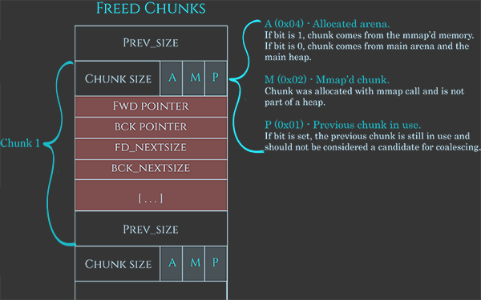
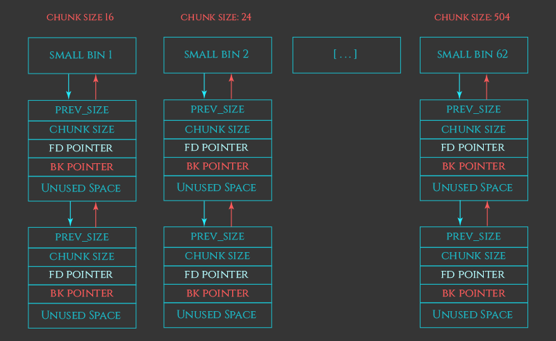

# Day 1 - Introduction

## WHAT IS HEAP?
Bài đầu tiên, chúng ta sẽ tìm hiểu Heap là gì.

Một chương trình C điển hình có cấu trúc bộ nhớ bao gồm 5 phần:
1. **Text segment**: chứa code thực thi của chương trình.
2. **Data segment**: chứa các biến global và biến static đã được khởi tạo giá trị bởi người dùng.
3. **BSS segment**: chứa các biến global và biến static không được khởi tạo giá trị một cách tường minh.
4. **Heap**: chứa dữ liệu được cấp phát động bởi người dùng.
5. **Stack**: được cấu trúc thành từng frame, mỗi frame là vùng nhớ riêng của một hàm, được sắp xếp theo thứ tự lời gọi hàm. 

Bộ nhớ Heap phát triển theo hướng từ địa chỉ thấp đến địa chỉ cao (ngược lại vào Stack), được cấu tạo thành các đơn vị bộ nhớ gọi là chunk với kích thước tùy thuộc vào người dùng yêu cầu. Mỗi khi người dùng gọi hàm `malloc()` (hay các hàm tương tự như calloc(), realloc(), ...), bộ nhớ sẽ cấp phát 1 vùng nhớ với kích thước phù hợp. Khi không dùng đến nữa, người dùng sẽ giải phóng vùng nhớ đó thông qua hàm `free` để có thể sử dụng lại vùng nhớ đó sau này (nhằm tiết kiệm bộ nhớ).

Một chunk sẽ có 1 trong 2 trạng thái: `allocated` hoặc `freed`.

## HEAP RULES
Heap giúp cho việc sử dụng bộ nhớ hiệu quả hơn, tuy nhiên để sử dụng nó một cách hiệu quả và an toàn người dùng cần tuân thủ các nguyên tắc sau:
1. Không đọc hoặc ghi vào một chunk nhớ đã `freed`.
	Nếu không sẽ đẫn đến lỗi **user after free**.
2. Không sử dụng hoặc leak thông tin chưa được khởi tạo trong một chunk.
	Nếu không sẽ đẫn đến lỗi **information leaks** hoặc **uninitialized data**.
3. Không đọc hoặc ghi vào các bytes nằm sau một chunk.
	Nếu không sẽ đẫn đến lỗi **heap overflow** hoặc **read beyond bounds**.
4. Không `free()` một chunk 2 lần.
	Nếu không sẽ đẫn đến lỗi **double free**.
5. Không đọc hoặc ghi vào các bytes nằm trước một chunk.
	Nếu không sẽ đẫn đến lỗi **heap underflow**.
6. Không `free()` một con trỏ chưa được khởi tạo bởi hàm `malloc()`.
	Nếu không sẽ đẫn đến lỗi **invalid free**.
7. Không sử dụng một con trỏ được khởi tạo bởi hàm `malloc()` nếu return value của `malloc` là NULL.
	Nếu không sẽ đẫn đến lỗi **arbitrary write**.

## CHUNK ALLOCATION STRATEGIES
Mỗi khi người dùng yêu cầu cấp phát (allocate) một vùng nhớ. Bộ nhớ sẽ theo chiến lược sau:
1. Nếu có một chunk nhớ đã free trước đó, và kích thước của nó đủ lớn so với yêu cầu của người dùng. Bộ nhớ sẽ cấp phát vùng nhớ đó.
2. Ngược lại, nếu có một vùng nhớ đủ lớn ở đỉnh của heap, bộ nhớ sẽ cấp phát vùng nhớ đó.
3. Ngược lại, bộ nhớ sẽ yêu cầu kernel cấp thêm vùng nhớ mới với đỉnh của heap và sử dụng nó cấp phát cho người dùng.
4. Nếu tất cả các chiến lược trên đều fail, bộ nhớ không thể allocate, `malloc()` sẽ return NULL.

#### ALLOCATING FROM FREE'D CHUNKS.
Các chunk đã được free sẽ được đưa vào các **bin**. **Bin** là danh sách dùng để truy dấu các chunks đã free. Có nhiều loại **bin**, Mỗi loại gồm nhiều **bin**. Mỗi **bin** được cấu trúc dưới dạng **singly linked list** hoặc **doubly linked list**. Mỗi node của **bin** là một chunk, có chứa con trỏ **FD** và **BK** để trỏ tới các chunk kế bên trong **bin**.

#### ALLOCATING FROM THE TOP OF THE HEAP.
Chunk nằm ở đỉnh heap được gọi là **top chunk** hoặc **remainder chunk**. Nếu không có chunk nào trong bin có thể allocate, bộ nhớ sẽ cấp phát vùng nhớ mới từ top chunk.

#### OFF-HEAP ALLOCATIONS VIA MMAP.
Nếu người dùng yêu cầu cấp phát một vùng nhớ quá lớn (>= 128KB-512KB trên 32bit-OS hoặc 32MB trên 64bit-OS). Chunk này sẽ được cấp phát off-heap thông qua lời gọi trực tiếp đến `mmap`. Khi chunk này được `freed`, nó sẽ được giải phóng trả về cho OS thông qua hàm `munmap`.

#### ARENA AND SUBHEAP.
Đối với các ứng dụng multithread, bộ nhớ cần phải tránh xảy ra lỗi race condition. Nó sử dụng khái niệm areana. Mỗi thread có một arena riêng. Mỗi arena là một vùng nhớ heap riêng biệt có các chunk được allocated và các free bins riêng.

Main arena là arena của main thread, và nó là arena duy nhất nếu đó là ứng dụng single-thread. Secondary arena là các arena thuộc về subheaps. Các secondary arenas nằm phía sau main arena trong heap.

## CHUNK STRUCTURE
Một chunk có 2 trạng thái: `allocated` và `freed`, tùy vào trạng thái của chunk mà cấu trúc chunk sẽ khác nhau. Mỗi chunk dù là `allocated` hay `freed` đều có vùng `metadata` để chứa thông tin về chunk đó. Bộ nhớ luôn cấp phát một chunk với kích thước là bội số của 4 (đối với 32 bit) hoặc 8 (đối với 64 bit).

#### ALLOCATED CHUNK
Metadata của một `allocated chunk` có kích thước 8 bytes (đối với hệ thống 32 bit) hoặc 16 bytes (đối với hệ thống 64 bit) bao gồm:
1. **prev_size**: Tuy nằm trong vùng metadata của chunk này nhưng thật ra lại chứa thông tin của chunk trước đó. Nếu chunk trước đó là `freed chunk`, nó sẽ chứa kích thước của chunk trước (tính luôn phần metadata). Nếu chunk trước đó là `allocated chunk`, bộ nhớ heap tận dụng nó để lưu trữ user data.
2. **chunk size**: kích thước của chunk hiện tại. Vì kích thước của chunk là bội số của 4 hoặc 8 nên 3 bit cuối của **chunk size** luôn là 0. Bộ nhớ tận dụng 3 bit này được ký hiệu là (A,M,P) để lưu trạng thái của chunk.
	- A (0x04): **Allocated area**, được set là 1 nếu chunk có nguồn gốc từ secondary arena, được set là 0 nếu chunk có nguồn gốc từ main arena. Bộ nhớ dùng bit này để biết nguồn gốc của chunk mà return con trỏ về cho main thread hay subthread.
	- M (0x02): **Mmap'd chunk**: được set là 1 nếu chunk được cấp phát off-heap qua `mmap`. Khi chunk được `freed`, Heap manager sẽ giải phóng bộ nhớ trả về cho OS qua `munmap` chứ không đưa nó vào bin để tái sử dụng.
	- P (0x01): **Previous chunk in use**: mang thông tin về chunk trước đó. Được set là 1 nếu chunk trước đó là `freed chunk`, là 0 nếu chunk trước đó là `allocated chunk`. Nhờ đó, khi chunk được `freed`, nó có thể biết được chunk trước đó là `freed chunk` và gộp 2 chunk lại thành một `freed chunk` lớn hơn.

Phần còn lại của chunk là **User Data**: chứa dữ liệu của chunk.

#### FREED CHUNK
Metadata của `freed chunk` cấu trúc tương tự `allocated chunk`, gồm 2 phần **prev_size** và **chunk size**. Sau khi 1 chunk được `freed`, nó sẽ được đưa vào **bin**. Các bins hoạt động theo cấu trúc **linked list**, do đó nó cần có cách nào đó để truy dấu các chunk nằm kế bên trong cùng 1 bin. Khi chunk được `freed`, vùng user data trở nên vô dụng. Bộ nhớ tận dùng vùng này để chứa 2 con trỏ **FD_Pointer** và **BK_Pointer** trỏ tới 2 chunk nằm trước và sau trong cùng 1 bin. Nhờ đó, khi người dùng yêu cầu cấp phát một vùng nhớ, bộ nhớ sẽ đi tìm nó trong các bins một cách dễ dàng.

## BINS 
Bin là một khái niệm của glibc để truy dấu các freed-chunk dưới dạng **linked list**. Nó tồn tại nhờ vào các con trỏ **FD_Pointer** và **BK_Pointer** của freeed-chunk, chứ nó không thật sự tốn thêm dung lượng bộ nhớ của chương trình. Mỗi khi chunk được freed, nó sẽ được đưa vào bin có kích thước tương ứng, để lần sau nếu người dùng yêu cầu cấp phát một chunk mới với kích thước tương tự, bộ nhớ sẽ lấy chunk ra khỏi bin và cấp phát ngay cho người dùng, thay vì phải tạo chunk mới từ top heap, giúp cải thiện hiệu năng của heap.

Để quá trình tái sử dụng các chunk được hiệu quả, bộ nhớ heap sử dụng nhiều loại bins khác nhau. Mỗi loại bao gồm nhiều bin. Mỗi bin là một list các freed chunk cùng kích thước hoặc kích thước gần bằng nhau (tùy vào loại bin). Có 5 loại bin trong glibc 2.27:

1. 62 **small bins**: dưới dạng *doubly linked list*. Mỗi bin lưu trữ các `freed chunk` có cùng kích thước, bao phủ kích thước chunk từ 0x10 bytes đến < 0x200 bytes (32 bit) hoặc < 0x400 bytes (64-bit).
2. 63 **large bins**: dưới dạng *doubly linked list*. Tương tự **small bins**, mỗi **large bin** lưu trữ các `freed chunk` cùng kích thước, bao phủ kích thước chunk >= 200 bytes (32 bit) hoặc >= 0x400 bytes (64 bit).
3. 1 **unsorted bin**: dưới dạng *doubly linked list*. Đây là một bin trung gian, chứa các chunk vừa mới được `freed`, và sẽ được trả lại vào các `small bins` hay `large bins` sau này. Điều này là nhằm cải thiện hiệu năng của heap. **Unsorted bin** chứa các chunk không cùng một kích thước, không giống như `small bin` và `large bin`.
4. 10 **fast bins**: dưới dạng *singly linked list*. Đây cũng là một dạng bin trung gian giúp cải thiện hiệu năng heap. **Fast bin** chứa các chunk cùng kích thước, và kích thước của **fast bin** là nhỏ, bao phủ kích thước 0x10 - 0x58 bytes (32 bit) hoặc 0x10 - 0x100 bytes (64 bit).
5. 64 **tcache bins** cho mỗi thread: dưới dạng *singly linked list*. Mỗi bin chứa tối đa 7 chunks cùng kích thước.**Tcache bin** là một loại bin mới được thêm vào kể từ glibc 2.26, nhằm cải thiện hiệu năng đối với các ứng dụng multi-threads. 

#### SMALL BINS

Small bins là loại bin đơn giản nhât. Có 62 small bins, mỗi bin chứa các chunk cùng kích thước. Dãy kích thước của các small bins lần luợt là: 0x10, 0x18, 0x20, ..., 0x1f8 (32 bit) hoặc 0x10, 0x20, 0x30, ..., 0x3e0 (64 bit). Small bins được lưu trữ dưới dạng doubly linked list, hoạt động theo kiểu FIFO (first in - first out).

#### LARGE BINS

Large bins là một loại bin cơ bản, tương tự như small bins. Có 63 large bins, mỗi bin chứa các chunk nằm trong một dãy kích thước cụ thể. Vì các ứng dụng có xu hướng sử dụng các vùng nhớ có kích thước nhỏ nên các large bin co cụm về phía kích thước nhỏ, nghĩa là các large bin càng nhỏ thì bao phủ dãy kích thước càng nhỏ.

Đối với 32 bit OS, 32 large bins đầu tiên chứa các chunk nằm trong dãy kích thước cách nhau 0x40 bytes:
- large bin 1: 0x200 - 0x238
- large bin 2: 0x240 - 0x278
- ...
